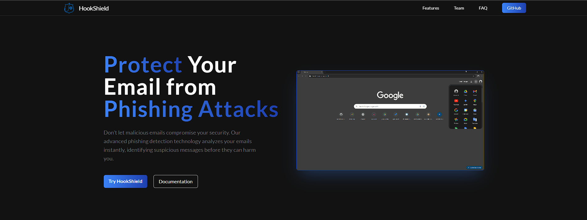
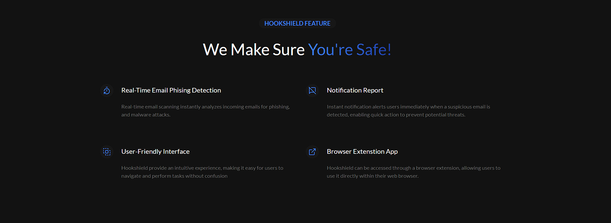

# HOOKSHIELD WEBSITE
This is a website landing page designed to represent the HookShield browser extension, which protects users from phishing and spam emails. This documentation provides a complete guide for the structure, functionality, and customization of the HookShield landing page built with React.js and Tailwind CSS.

## Tech Stack
- React.js
- Tailwind
- Vite
- Lucide-React

## Use Template
`Clone Repository`
```bash
git clone https://github.com/neinAlkem/hookshield-website.git 
```
`Run Project`
```bash
npm run dev
```
## Project Documentation
`Hero Section`



`Feature Section`




